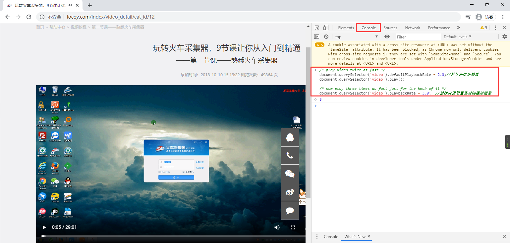

# 强制在线视频多倍速播放

> 主流视频网站已经有不少的视频网站，自带了播放加速的功能，例如YouTube、bilibili、iqiyi、imooc等等。
> 但是在一些其它教程网站中，任然有一些网站自带的播放器是不支持视频加速的，例如火车头官网教程，咱们就可以用下面这种方法解决在线视频不能倍速播放的问题，这边做一个记录。

在播放页面按下`F12`键进入浏览器调试模式，选择`console`标签中加入以下js代码即可实现视频多倍速播放：代码如下：

```javascript
/* play video twice as fast */
document.querySelector('video').defaultPlaybackRate = 2.0;//默认两倍速播放
document.querySelector('video').play();

/* now play three times as fast just for the heck of it */
document.querySelector('video').playbackRate = 3.0;  //修改此值设置当前的播放倍数
```

操作步骤如下图所示：





注：此方法只适用于H5页面播放。

