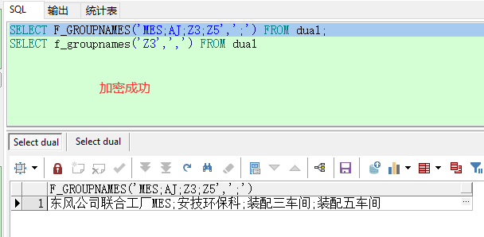

如何批量加密`Oracle PLSQL`程序？

### 1. 导出对象

1. 批量导出所有除类型为`TABLE`以外的对象，根据需要手动选择对象；


<!--  -->

### 2. 开始加密

1. 打开`CMD`命令窗口，输入命令：

   ```cmd
   wrap iname=input.prc oname=output.prc
   ```
   

注：iname输入文件名，oname输出文件名。


<!--  -->


### 3. 加密完成
<!-- -->


### 4. 导入数据库
<!-- -->


加密前后效果对比
<!-- -->

<!-- -->


### 5. 验证结果
<!-- -->



至此，plsql 程序批量加密完成！


本教程不设打赏码，如果你硬要感谢，那我也拦不住你点击页面广告，这也是打赏的一种方式，不过能不能看到页面广告全凭运气了。

反手就是推荐一个网址：[云主页_ZhuYe.Cloud](https://www.baidu.com/link?url=qjbSoDIEtQ0nuNk91hn1fPK05iGz59nKvZfj_Fk2f_C&wd=&eqid=f6f703c0000410b8000000055e75a21c)，如果你不明白他是干什么的，请百度搜下 [**云主页**](https://www.baidu.com/s?ie=UTF-8&wd=%E4%BA%91%E4%B8%BB%E9%A1%B5) 。

