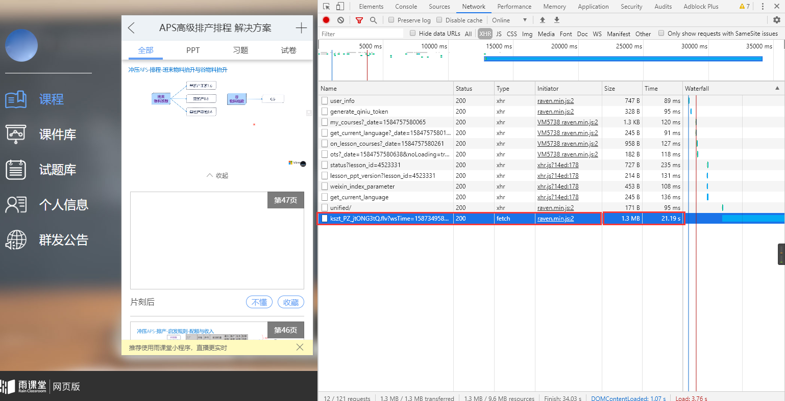
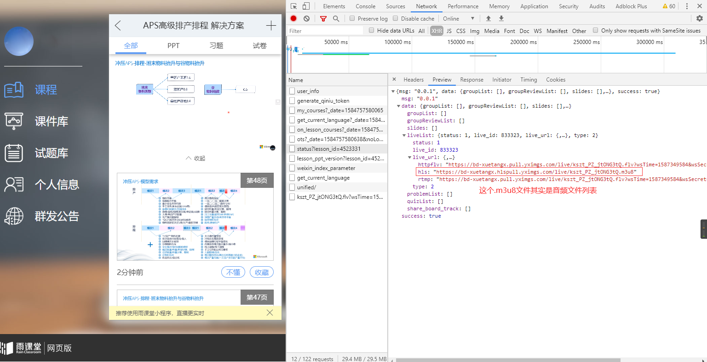
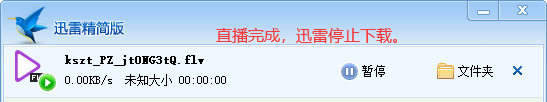
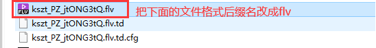
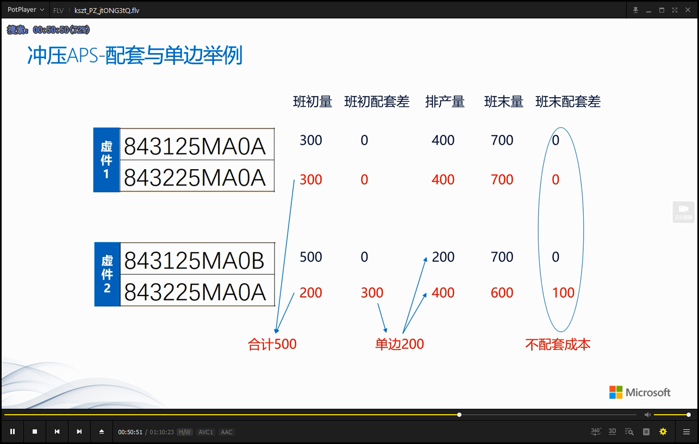
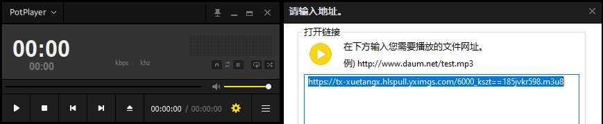
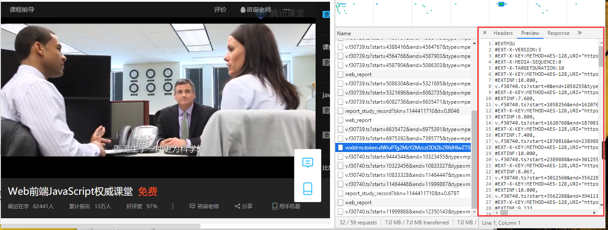
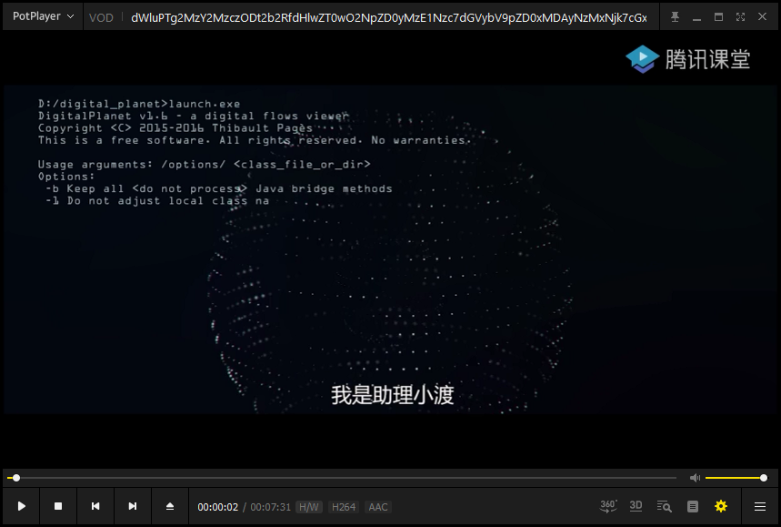
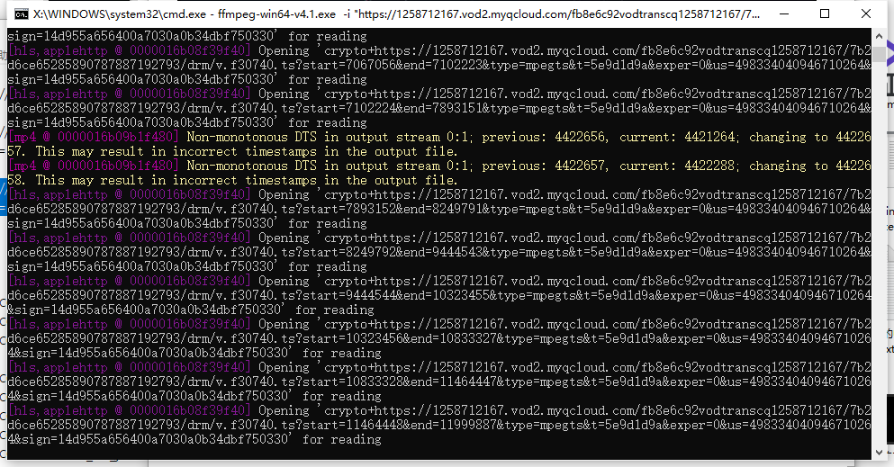
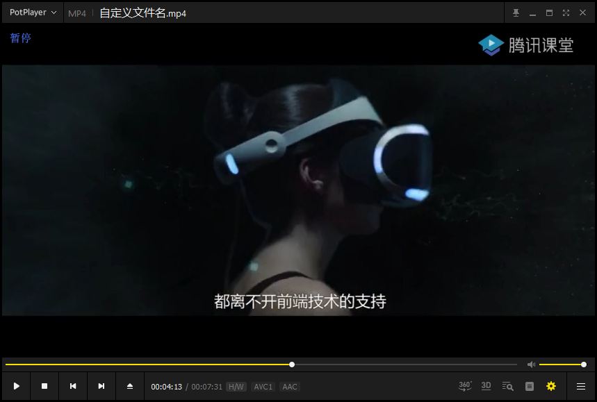

本教程主要写雨课堂直播课下载和腾讯课堂录播课下载方法，不需要课堂客户端，用到的软件：

1. H5浏览器：Chrome
2. 下载器：迅雷精简版
3. 播放器：Potplayer
4. 视频处理：FFmpeg

此方法可适用于大部分视频播放平台（教程网、影视网），由于创作者（OAnote）比较直，全程没有多余废话，可能存在有部分（女）同学看不懂的情况，放心，小编会手把手教，不分昼夜/笑哭。

> **雨课堂**是清华大学和学堂在线共同推出的新型智慧教学解决方案。
>
> **腾讯课堂**是*腾讯*推出的专业在线教育平台，聚合大量优质教育机构和名师，下设职业培训、公务员考试、托福雅思、考证考级、英语口语、中小学教育等众多在线学习精品课程，打造老师在线上课教学、学生及时互动学习的*课堂*。

# 雨课堂---直播课下载

1. 进入播放界面，打开浏览器调试模式，找到视频播放请求：

   

2. 这个请求时间比较长的就是直播视频地址，flv格式地址复制到浏览器后回车就可以直接下载了，或者复制到迅雷下载地址框。

   

3. 开始下载，当直播完毕后，迅雷出现看不到下载速率的情况，此时关闭迅雷进入下载的文件夹，改下文件的后缀名，不要问为什么，问就是不改播放器打不开视频后缀名错误的文件。

   

   

4. 播放视频

   

   完美播放！

   注意：上面的下载flv视频流方法也可以用`FFmpeg`去下载，下载后自动转换任意需要的格式：

   ```
   ffmpeg-win64-v4.1.exe -i "https://bd-xuetangx.pull.yximgs.com/live/kszt_PZ_jtONG3tQ.flv?wsTime=1587345235&wsSecret=b2ffc9506069c9d2b3949fd94d785357" -c copy APS续集flv1.mp4
   ```

遇到的坑：

现在的课堂直播类平台，考虑到观看网络情况和上课前的语音节省流量等其它因素，会把音频单独存放在一个文件列表中（`.m3u8`格式），第一次下载雨课堂，看到`.m3u8`就以为是需要下载的视频文件列表了，导致下载后发现没有画面只有声音。/笑哭

如何验证`.m3u8`文件是音频还是视频呢，只需复制`.m3u8`请求地址到本地播放器或者网络视频播放器进行验证。




# 腾讯课堂---录播课下载

1、下载步骤和雨课堂方法类似，先找到`.m3u8`文件请求地址，`.m3u8`文件内容格式如下图所示：



我们找到的`.m3u8`文件请求地址是：

```
https://1258712167.vod2.myqcloud.com/fb8e6c92vodtranscq1258712167/7b2d6ce65285890787887192793/drm/voddrm.token.dWluPTg2MzY2MzczODt2b2RfdHlwZT0wO2NpZD0yMzE1Nzc7dGVybV9pZD0xMDAyNzMxNjk7cGxza2V5PTAwMDQwMDAwMzUzNTA5OTNhODhjYjBlNmM5MzM0NTZhNmY0NGQ3ZmQzZWU0OTczY2U0MDk5YmQ5ODIzYzFiOGMwY2FkZjQxNjhkNzBjN2EzYWEwOGI0Yzg7cHNrZXk9.v.f30740.m3u8?t=5e9d1d9a&exper=0&us=498334040946710264&sign=14d955a656400a7030a0b34dbf750330
```

同样放到播放器进行验证是否有画面：



方法：使用`FFmpeg`下载，输出MP4格式，方法

```
ffmpeg-win64-v4.1.exe -i "https://1258712167.vod2.myqcloud.com/fb8e6c92vodtranscq1258712167/7b2d6ce65285890787887192793/drm/voddrm.token.dWluPTg2MzY2MzczODt2b2RfdHlwZT0wO2NpZD0yMzE1Nzc7dGVybV9pZD0xMDAyNzMxNjk7cGxza2V5PTAwMDQwMDAwMzUzNTA5OTNhODhjYjBlNmM5MzM0NTZhNmY0NGQ3ZmQzZWU0OTczY2U0MDk5YmQ5ODIzYzFiOGMwY2FkZjQxNjhkNzBjN2EzYWEwOGI0Yzg7cHNrZXk9.v.f30740.m3u8?t=5e9d1d9a&exper=0&us=498334040946710264&sign=14d955a656400a7030a0b34dbf750330" -c copy 自定义文件名.mp4
```

下载过程如下图所示，下载完成后自动停止：



完美播放：




本教程不设打赏码，如果你硬要感谢，那我也拦不住你点击页面广告，这也是打赏的一种方式，不过能不能看到页面广告全凭运气了。

反手就是推荐一个网址：[云主页_ZhuYe.Cloud](https://www.baidu.com/link?url=qjbSoDIEtQ0nuNk91hn1fPK05iGz59nKvZfj_Fk2f_C&wd=&eqid=f6f703c0000410b8000000055e75a21c)，如果你不明白他是干什么的，请百度搜下 [**云主页**](https://www.baidu.com/s?ie=UTF-8&wd=%E4%BA%91%E4%B8%BB%E9%A1%B5) 。

